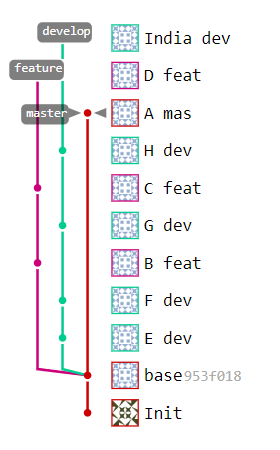
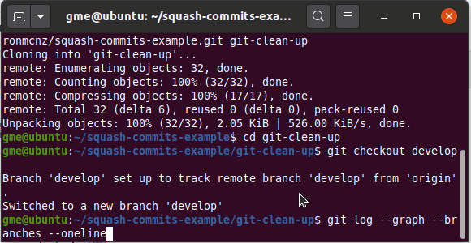
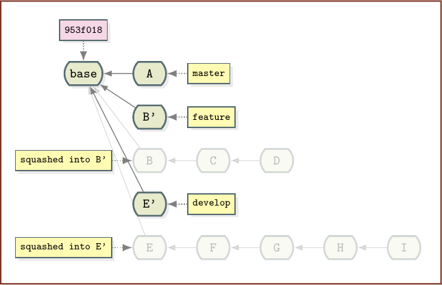
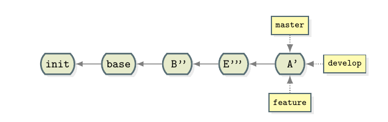
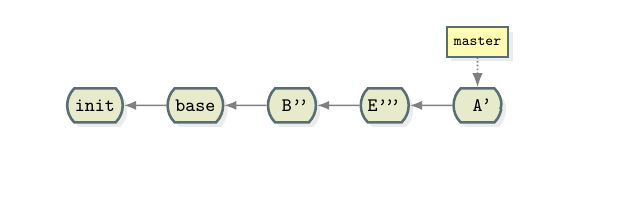
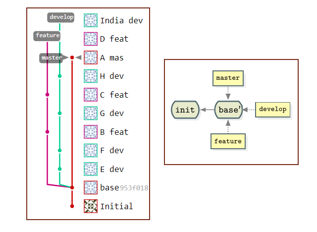

> The article is excerpted from [Clean Git up!](https://www.theserverside.com/blog/Coffee-Talk-Java-News-Stories-and-Opinions/How-to-clean-up-Git-branches-and-commits).

Things accumulate over time, and version control systems can be subject to the same hoarding tendencies that haunt people in their everyday lives.

Developers aren’t immune to clutter, and the same can be said about their Git repositories.

There comes a point where you must clean up Git. Branches, commits and repositories require a good trim occasionally.

In this Git clean up tutorial, we’ll demonstrate how to take a moderately messy repository and reduce it to only a few commits.

# Steps to clean up Git

There are many angles from which a developer might tackle a Git clean up. Follow these steps to tactically clean your git repository:

- Rebase to avoid messy merge points
- Delete stale Git branches
- Squash commit histories down to nothing
- Perform aggressive Git garbage collection

# Clean up Git Commits

The first order of business with any Git cleanup operation is to squash any lengthy commit histories. In this example repository, there’s only one unshared commit on the master branch, but multiple on feature and develop branches. A developer can use the interactive Git rebase tool to squash all commits on a given branch down to one.



A developer can also squash Git commits on the develop branch. They will need to first perform a checkout and then invoke the `git rebase` command with a reference to the number of commits on the branch:

```shell
cleanup@git:~$ git checkout develop 
cleanup@git:~$ git log --graph --branches --oneline
cleanup@git:~$ git rebase --interactive HEAD~5
```

In the interactive rebase tool, the commit named `E dev` is set to be the target of the squash by pre-pending the word `pick` next to it. The letter `s` or the word `squash` is pre-pended to all other commits to indicate they will be removed.

<figure>

<figcaption>These commits and branches will be the target of the Git clean up..</figcaption>
</figure>

When the rebase commits, a successful Git cleanup of the develop branch’s commits occurs and squashes them all into one. The new Git commit created in the process is given the name E'.

The same Git cleanup also needs to be performed on the three commits in the feature branch. Developers don’t need to use the HEAD~ syntax, either. It’s perfectly acceptable to simply reference the hash ID of the commit from which the branch diverged. In this case, that ID is 953f018.



```bash
cleanup@git:~$ git checkout feature
cleanup@git:~$ git rebase --interactive 953f018
```

At this point, the individual branches have been cleaned up, but none of the code has been synchronized through a merge. With three branches, four rebase operations will completely synchronize each branch and ensure that no code will be lost in any future Git cleanup operations.

# The Git rebase merge

The four rebase commands needed to synchronize all three branches are:

```bash
cleanup@git:~$ git rebase feature develop
cleanup@git:~$ git rebase develop master
cleanup@git:~$ git rebase master feature
cleanup@git:~$ git rebase feature develop
```



# Clean up Git branches

There’s really no need to have three branches that point to the same commit. A developer can identify a Git branch clean up task that deletes features and develops with a hard D:

```bash
cleanup@git:~$ git branch -D feature
cleanup@git:~$ git branch -D develop
```



# Git rebase vs merge

If anyone wonders why I performed four rebases instead of just merging the develop and feature branches into the master before I deleted them, I don’t have a good response.

But yes, merging would have been easier and would have been a simpler way to arrive at this point in the Git clean up. But I doubt you’ll ever see another Git tutorial that does four rebases in a row, which is a reason in itself to do it.

A developer can run the following commands instead of the rebase and delete.

```bash
merge@loser:~$ git checkout master
merge@loser:~$ git merge feature
merge@loser:~$ git merge develop
merge@loser:~$ git branch -D feature 
merge@loser:~$ git branch -D develop
```

# One last Git squash rebase

Finally, with no other branches hanging around, you can once again squash the entire master branch down to two commits. Also, it’s more common to use the `-i` switch rather than the long-winded rebase `–interactive`. During the interactive rebase, name the new commit base’.

```bash
cleanup@git:~$ git rebase -i HEAD~4
```

After the rebase, the Git repository will have been reduced to two lonely commits.

If a developer uses `Git Flow`, they might want to resurrect the develop and feature branch names at this time.

```bash
cleanup@git:~$ git branch develop
cleanup@git:~$ git branch feature
```

When these two operations are complete, the repository has been reduced to two commits, with all three branches pointing at the same one.

Developers should also note that all the files contained in the tips of the original three branches reside in base’. Commits and branches have been removed, but every file has been retained and no files have been lost. Every file present at the tip of the three branches before this Git clean up began is in base’.



# Git garbage collection

With all the Git cleanup operations complete, it’s time to take out the trash. Developers can force a Git garbage collection routine to dispose of all the deleted branches and commits:

```bahs
cleanup@git:~$ git gc --aggressive
```

And that's how to clean up Git branches and commits.

You can find the source code for this example on [GitLab](https://gitlab.com/cameronmcnz/squash-commits-example/-/network/master).