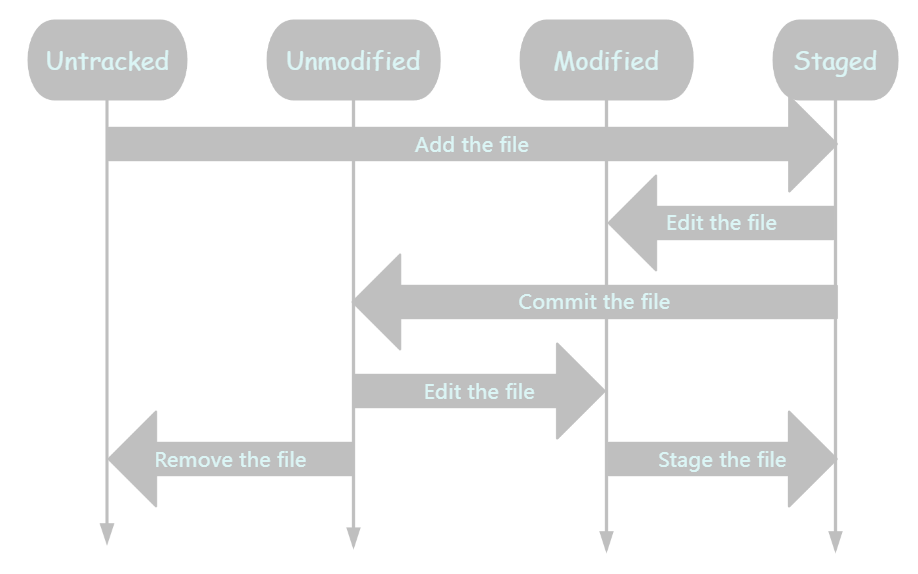

# Prerequisite

In Git, files usually have four statuses: untracked, unmodified, modified and staged.



Untracked and modified files reside in the working directory, while staged files situated in the staging area, and unmodified files are stored in the .git directory (repository). The unmodified files is actually the committed files.


# Applay git clean to Delete Untracked Files

The `git clean` command removes all untracked files and provides three flags or switches to define which untracked files to remove: 

- `-f` flag obliges the removal of all untracked files, excluding directories and ignored files.
- `-d` flag obliges the removal of untracked directories.
- `-x` flag eliminates untracked files corresponding to `.gitignore` files.

We can clear untracked files with the following command:

```bash
$ git clean -df
Removing test.txt
Removing test/
```

The `-df` option ensures that removal is forced and that untracked directories are also included for removal.

```bash
$ git clean
fatal: clean.requireForce defaults to true and neither -i, -n, nor -f given; refusing to clean
```

A git clean requires force.

Additionally, using the command requires the developer to provide either the –force or –dry-run (-n) switch. It is important to note that –force and –dry-run switches both require two dashes.

Failing to provide either switch will cause the Git clean command to fail, and the system will generate an error message.

# Remove untracked files with caution

Heed the following cautions:

- Once untracked files are deleted, they cannot be recovered and they bypass the recycle bin.
- The git clean command has the potential to remove significant property or configuration files.
- Before proceeding with the untracking of git files, it is always wise to undertake a dry run.
  ```bash
    $ git clean -n
    Would remove clean-cache.ini
    Would remove clean-untracked.txt
    Would remove clean-stash.html
  ```
- The git clean interactive mode can be utilised to isolate particular files for deletion, thus ensuring maximum control.
- Sometimes, in certain use cases, `git stash` can be more effective than `git clean`.

> <big>Developers ought to exercise caution when using the git clean command.</big>