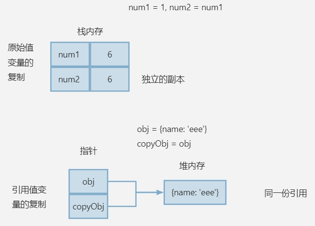

# 变量

JavaScript 中的变量是松散的，它可以在初始化后再次改变类型。

JavaScript 中的变量声明使用的关键字（var、let、const）也与常见编程语言不同，其作用不是指定其类型，而是限定其作用域。

JavaScript 变量的类型由其值决定，变量值类型改变，变量类型随之改变。

## 原始值和引用值

JavaScript 变量值分为原始值和引用值。

原始值（primitive value）是最简单的数据，大小固定，保存在栈内存，有 6 中原始值类型：

- Undefined
- Null
- Boolean
- Number
- String
- Symbol

引用值是由多个值（既可以是原始值，也可以是引用值）组合成的**对象**，动态大小，引用值的地址值保存在栈内存，其指向的是该地址对应的保存在堆内存上的真实数据。

## 字面量

字面量就是字面上的纯数据。

原始值以及引用值的初始化既可以使用纯数据，也可以使用 `new` 执行对应类型的构造函数，通过后者得到的原始值就与对象的表现类似：

```javascript
let name = new String("张三");
// 可以添加属性
person.age = 23;
console.log(person.age); // 23
// typeof 返回 Object
console.log(typeof name); // object
```

## 属性

原始值没有属性，也不能添加属性，引用值可以动态地添加、修改和删除属性。

## 复制值

JavaScript中，原始值的复制就是复制其在栈内存上的值，引用值的复制实际上复制的是其位于栈内存的引用地址值。



## 传递参数

ECMAScript 中所有参数都是按值传递的。这意味着中间存在变量的复制。

### 形参与实参

形参是函数局部变量，实参是函数外部变量以及形参的来源。

### 按值传递和按引用传递

从变量到数据，涉及到存储寻址，一个变量名对应一个地址，访问该地址获取到改地址的值，值可以为原始值或者另一个地址，地址值指示真正数据的位置。

● 地址 1 -数据

● 地址 1 -地址 2 -数据

按值传递：形参、实参的地址 1 不同，但是地址 1 对应的数据或者地址 2 是相同的，这个也是按值所传递的东西。

按引用传递：形参、实参地址 1 相同，所以后面寻址操作是一样的。

```javascript
function setName(obj) {
    obj.name = "Nicholas";
    obj = new Object();
    obj.name = "Greg";
}
let person = new Object();
setName(person);
console.log(person.name); // "Nicholas"
```

上述代码中，函数 setName 第二行重写了 obj，再修改 obj 无效，正是因为按值传递，重写 obj 是修改 obj 地址对应的数据，obj 这个形参与实参 person 的地址不同，重写 obj 不会导致 person 重写。

## 变量类型判断

常见的类型判断方法是使用 `typeof` 和 `instanceof`。

typeof 适合判断一个变量是否是原始值。如果值是对象或 null，typeof 都会返回 null。使用 typeof 检测函数返回 function。

对于对象，使用 instanceof 操作符。对于该对象原型链上的所有原型，instanceof 都返回 true。若对原始值使用 instanceof，则返回 false。

## 变量声明

### var 声明

在使用 var 声明变量时，变量会被自动添加到最接近的上下文。在函数中，最接近的上下文就是函数的局部上下文。在 with 语句中，最接近的上下文也是函数上下文。如果变量未经声明就被初始化了，那么它就会自动被添加到全局上下文。

var声明（不包含赋值）会被拿到函数或全局作用域的顶部，位于作用域中所有代码之前，这个现象叫作“提升”（hoisting）。
提升让同一作用域中的代码不必考虑变量是否已经声明就可以直接使用。

```javascript
console.log(a); // undefined，变量声明已提升，但赋值未提升
var a = 10;

/** 等价于 **/

var a;
console.log(a); // undefined
a = 10;
```

函数声明也会被提升到作用域顶部，且整个函数体都会被提升。

```javascript
sayHello(); // "Hello!"
function sayHello() {
  console.log("Hello!");
}

/** 等价于 **/

function sayHello() {
  console.log("Hello!");
}
sayHello(); // "Hello!"
```

函数的提升优先级高于 var 变量提升。

```javascript
console.log(foo); // ƒ foo() { return "function"; }
var foo = "variable";
function foo() {
  return "function";
}
console.log(foo); // "variable"

/** 等价于 **/

function foo() {
  return "function";
}
var foo;
console.log(foo); // ƒ foo() { return "function"; }
foo = "variable";
console.log(foo); // "variable"
```

### let 声明

ES6新增的let关键字跟var很相似，但它的作用域是块级的，这也是JavaScript中的新概念。块级作用域由最近的一对包含花括号{}界定。
换句话说，if块、while块、function块，甚至连单独的块也是let声明变量的作用域。

let 与 var 的另一个不同之处是在同一作用域内不能声明两次。重复的 var 声明会被忽略，而重复的 let 声明会抛出 SyntaxError。

严格来讲，let 在 JavaScript runtime 中也会被提升，但由于<b>暂时性死区（temporal dead zone）</b>的缘故，
实际上不能在声明之前使用 let 变量。因此，从写 JavaScript 代码的角度说，let 的提升跟 var 是不一样的。

### const 声明

使用 const 声明的变量必须在声明时初始化，并且在其生命周期内不能重新赋值。除了这一点外，const 的行为与 let 相同。

const 声明的限制仅适用于变量的顶层值或引用。换句话说，如果一个 const 变量引用的是对象，则不能将该变量重新赋予新的引用值，
但对象本身的属性可以修改。如果需要让整个对象不可更改，可以使用 `Object.freeze()` 方法，这样对对象属性的修改不会报错，但会静默失败。

由于 const 声明意味着变量的值是固定的且不可变，JavaScript 的运行时编译器可以将其优化为直接使用值，而无需通过变量查找。
所以在实际开发中，建议尽量使用 const 来声明变量。

# 执行上下文与作用域

## 执行上下文

<mark>每当函数被调用、全局代码运行、或 eval 代码运行时，都会创建一个新的执行上下文，依此分为全局执行上下文、函数执行上下文、eval执行上下文。</mark>

全局上下文是最外层的上下文。根据 ECMAScript 实现的宿主环境表示全局上下文的对象可能不一样（如浏览器中的 window 或 Node.js 中的 global），使用 var 声明的顶级变量会被添加到该对象上，使用 let 或 const 声明的顶级变量则被添加到脚本（Script）作用域，但三者在作用域的表现上是一样的。

函数调用时会创建函数上下文。函数执行时，函数的上下文会进入一个上下文栈，JavaScript 程序执行依靠的就是这个栈的控制。函数执行完后，其上下文会被弹出。

变量或函数的上下文决定了它们的生命周期、可以访问哪些数据以及它们的行为，即它们的执行环境。

每个上下文都关联一个**变量对象（variable object, vo）**，而这个上下文中定义的所有变量和函数都存在于这个对象上。如果上下文是函数，则其<b>活动对象（activation object）</b>用作变量对象。对于全局作用域，变量对象是全局对象（例如浏览器中的 window）。上下文包含以下三个重要部分：

1. 变量环境：是词法环境的一种特殊情况，专门用于存储通过 var 声明的变量。
2. 词法环境：包含当前上下文的标识符（变量、函数）以及对父级上下文的引用。let 和 const 是存储在词法环境中的，它们支持块级作用域，并具有 <cite>TDZ[^1]</cite> 特性。
3. this 绑定：确定上下文中 this 的值，根据调用位置动态分配。

[^1]: Temporal Dead Zone，暂时性死区，指变量只有声明后才能使用。

执行上下文是动态的，所以它拥有生命周期：

1. 创建阶段
    - 变量对象初始化
    - 作用域链创建
    - this 绑定
2. 执行阶段
    - 查找作用域链
3. 销毁阶段
    - 上下文在其所有代码都执行完毕后会被销毁，包括定义在它上面的所有变量和函数。

## 作用域 Scope

作用域是变量和函数的可访问范围。它决定了代码中可以访问哪些变量。

作用域分为全局作用域、函数作用域和块作用域。

当前上下文的变量对象会与父级上下文的作用域链连接，形成一个作用域链。当访问一个变量时，JavaScript 引擎会沿着作用域链逐级向上查找，直到找到变量或到达全局作用域。上下文间是线性有序的，内部上下文可以通过作用域链访问外部上下文中的一切，但外部上下文无法访问内部上下文中的任何东西。

## 函数的 [[Scopes]] 属性

函数的 [[Scopes]] 属性是 JavaScript 引擎内部用于实现作用域链的一个隐藏属性。它存储的是函数创建时的词法环境的引用，即是能够访问的所有外部作用域，是实现闭包的重要机制。这些作用域是按照作用域链的顺序排列的，最外层的作用域通常是全局作用域。

### 查看 [[Scopes]] 属性

1.使用 `debugger` 断点调试

```javascript
function outer() {
  debugger;
  let outerVar = "I am outer";
  function inner() {
    debugger;
    let innerVar = "I am inner";
    console.log(outerVar); // 访问外部作用域的变量
  }
  return inner;
}
let myInner = outer();
myInner();
```

2.使用 `console.dir()`

```javascript
function outer() {
  let outerVar = "I am outer";
  function inner() {
    let innerVar = "I am inner";
    console.dir(arguments.callee); // 访问自身
    console.log(outerVar); // 访问外部作用域的变量
  }
  console.dir(arguments.callee);
  return inner;
}
let myInner = outer();
myInner();
console.dir(myInner);
```

## 执行上下文与作用域的关系

1. 作用域在定义时确定（静态），执行上下文在运行时创建（动态）。
2. 每个执行上下文都包含一个作用域链。
